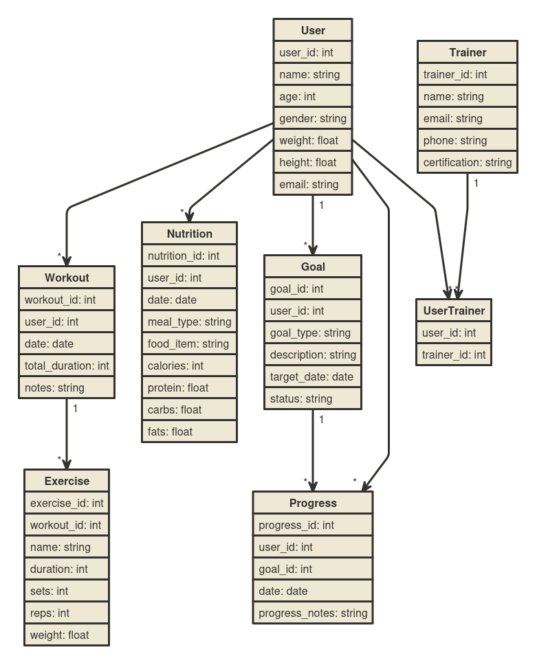

### Design Document

Paul K. AGBENYEZI

Video overview: <URL HERE>

## Scope

### Purpose
The purpose of the Personal Fitness Tracker Database is to help users log and manage their fitness activities, nutrition, goals, and progress. This system aims to provide a comprehensive tool for individuals to monitor their health and fitness journey and for personal trainers to manage their clients' fitness data efficiently.

### Included in Scope
- **Users**: Individuals using the fitness tracker.
- **Workouts**: Detailed records of physical activities performed by users.
- **Exercises**: Specific exercises that make up a workout.
- **Nutrition**: Records of food intake and nutritional information.
- **Goals**: Fitness goals set by users.
- **Progress**: Tracking progress towards goals.
- **Trainers**: Personal trainers who manage multiple users.

### Outside Scope
- **Medical Records**: Detailed medical history or records beyond basic fitness and nutrition data.
- **Financial Data**: Financial transactions or billing information for personal trainers.
- **Real-time Data**: Live tracking of workouts or nutrition intake in real-time.

## Functional Requirements

### User Capabilities
- **Log Workouts**: Users should be able to record their workout sessions, including the date, duration, and notes.
- **Track Nutrition**: Users should be able to log their meals, including calories, protein, carbs, and fats.
- **Set Goals**: Users should be able to define fitness goals with target dates and descriptions.
- **Monitor Progress**: Users should be able to track their progress towards goals with dated notes.
- **Trainer Management**: Trainers should be able to manage their clients and track their progress.

### Beyond Scope
- **Real-time Tracking**: The database will not support real-time tracking of workouts or nutrition.
- **Advanced Analytics**: Complex data analysis or machine learning predictions are beyond the scope.

## Representation

### Entities

#### Users
- **Attributes**: `user_id`, `name`, `age`, `gender`, `weight`, `height`, `email`
- **Types and Constraints**: 
  - `user_id`: INT, PRIMARY KEY, AUTO_INCREMENT
  - `name`: VARCHAR(100)
  - `age`: INT
  - `gender`: VARCHAR(10)
  - `weight`: FLOAT
  - `height`: FLOAT
  - `email`: VARCHAR(100), UNIQUE
- **Rationale**: Ensures each user has a unique identity and provides essential personal information for fitness tracking.

#### Workouts
- **Attributes**: `workout_id`, `user_id`, `date`, `total_duration`, `notes`
- **Types and Constraints**: 
  - `workout_id`: INT, PRIMARY KEY, AUTO_INCREMENT
  - `user_id`: INT, FOREIGN KEY REFERENCES `Users(user_id)`
  - `date`: DATE
  - `total_duration`: INT
  - `notes`: TEXT
- **Rationale**: Captures workout details linked to a user.

#### Exercises
- **Attributes**: `exercise_id`, `workout_id`, `name`, `duration`, `sets`, `reps`, `weight`
- **Types and Constraints**: 
  - `exercise_id`: INT, PRIMARY KEY, AUTO_INCREMENT
  - `workout_id`: INT, FOREIGN KEY REFERENCES `Workouts(workout_id)`
  - `name`: VARCHAR(100)
  - `duration`: INT
  - `sets`: INT
  - `reps`: INT
  - `weight`: FLOAT
- **Rationale**: Records specific exercises within a workout for detailed tracking.

#### Nutrition
- **Attributes**: `nutrition_id`, `user_id`, `date`, `meal_type`, `food_item`, `calories`, `protein`, `carbs`, `fats`
- **Types and Constraints**: 
  - `nutrition_id`: INT, PRIMARY KEY, AUTO_INCREMENT
  - `user_id`: INT, FOREIGN KEY REFERENCES `Users(user_id)`
  - `date`: DATE
  - `meal_type`: VARCHAR(50)
  - `food_item`: VARCHAR(100)
  - `calories`: INT
  - `protein`: FLOAT
  - `carbs`: FLOAT
  - `fats`: FLOAT
- **Rationale**: Tracks users' nutritional intake to monitor diet.

#### Goals
- **Attributes**: `goal_id`, `user_id`, `goal_type`, `description`, `target_date`, `status`
- **Types and Constraints**: 
  - `goal_id`: INT, PRIMARY KEY, AUTO_INCREMENT
  - `user_id`: INT, FOREIGN KEY REFERENCES `Users(user_id)`
  - `goal_type`: VARCHAR(100)
  - `description`: TEXT
  - `target_date`: DATE
  - `status`: VARCHAR(50)
- **Rationale**: Allows users to set and track fitness goals.

#### Progress
- **Attributes**: `progress_id`, `user_id`, `goal_id`, `date`, `progress_notes`
- **Types and Constraints**: 
  - `progress_id`: INT, PRIMARY KEY, AUTO_INCREMENT
  - `user_id`: INT, FOREIGN KEY REFERENCES `Users(user_id)`
  - `goal_id`: INT, FOREIGN KEY REFERENCES `Goals(goal_id)`
  - `date`: DATE
  - `progress_notes`: TEXT
- **Rationale**: Monitors progress towards specific goals over time.

#### Trainers
- **Attributes**: `trainer_id`, `name`, `email`, `phone`, `certification`
- **Types and Constraints**: 
  - `trainer_id`: INT, PRIMARY KEY, AUTO_INCREMENT
  - `name`: VARCHAR(100)
  - `email`: VARCHAR(100)
  - `phone`: VARCHAR(20)
  - `certification`: VARCHAR(100)
- **Rationale**: Manages personal trainers' information.

#### User_Trainers
- **Attributes**: `user_id`, `trainer_id`
- **Types and Constraints**: 
  - `user_id`: INT, FOREIGN KEY REFERENCES `Users(user_id)`
  - `trainer_id`: INT, FOREIGN KEY REFERENCES `Trainers(trainer_id)`
  - PRIMARY KEY (`user_id`, `trainer_id`)
- **Rationale**: Links users with their trainers.

### Relationships

#### Entity Relationship Diagram (ERD)
Below is the Entity Relationship Diagram (ERD) for the proposed database:




## Optimizations

### Indexes
- **Index on `user_id` in `Workouts`**: To speed up queries retrieving all workouts for a specific user.
- **Index on `user_id` in `Nutrition`**: To optimize queries fetching nutrition records for a user.
- **Index on `user_id` and `goal_id` in `Progress`**: To improve the performance of queries tracking progress towards goals.
- **Index on `user_id` in `Goals`**: To accelerate retrieval of user-specific goals.

```sql
-- Indexes for optimization
CREATE INDEX idx_user_id_workouts ON Workouts(user_id);
CREATE INDEX idx_user_id_nutrition ON Nutrition(user_id);
CREATE INDEX idx_user_id_goal_id_progress ON Progress(user_id, goal_id);
CREATE INDEX idx_user_id_goals ON Goals(user_id);
```

### Views
- **User Summary View**: A view summarizing user details, workouts, and goals for quick reporting.

```sql
CREATE VIEW UserSummary AS
SELECT U.user_id, U.name, U.email, COUNT(W.workout_id) AS total_workouts, COUNT(G.goal_id) AS total_goals
FROM Users U
LEFT JOIN Workouts W ON U.user_id = W.user_id
LEFT JOIN Goals G ON U.user_id = G.user_id
GROUP BY U.user_id, U.name, U.email;
```

## Limitations

### Design Limitations
- **Scalability**: Initial design may not handle extremely large datasets efficiently without further optimization.
- **User Interface**: This project focuses on the backend database and does not include a user-friendly interface.
- **Real

-time Tracking**: The database is not designed for real-time data entry and tracking.

### Representation Limitations
- **Complex Analytics**: Advanced analytics and machine learning are beyond the scope of this database.
- **Medical History**: Detailed medical records and history are not represented in the current design.
- **Financial Transactions**: Billing or financial information for trainers and users is not included.